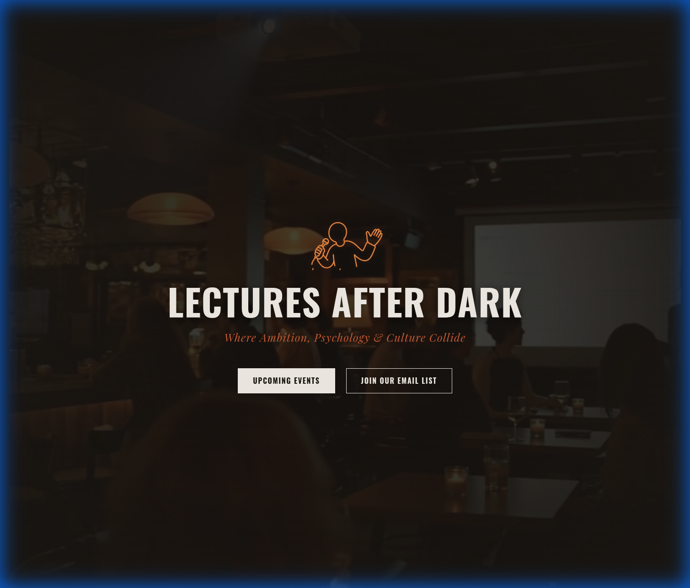
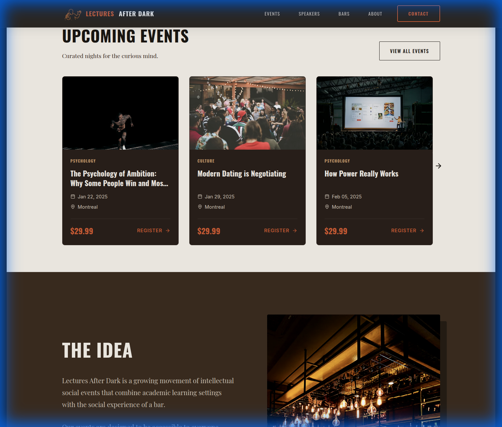
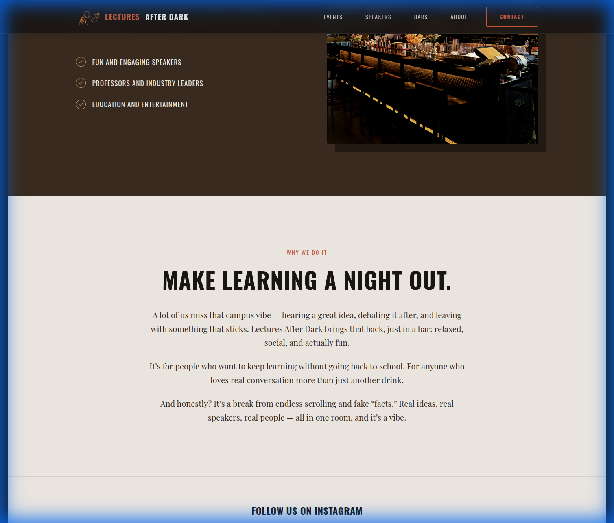

# Visual Design Report: Lectures After Dark Home Page

**Date:** 2025-12-25
**Page Analyzed:** Home Page (Desktop View)

## Executive Summary
The "Lectures After Dark" home page establishes a clear mood with its dark aesthetic and "night out" theme. However, the execution suffers from significant readability issues, particularly in the Hero section, and a lack of visual polish in spacing and typography consistency. The design feels "safe" but unrefined, missing the premium, "curated" feel promised by the brand.

## Visual Analysis & Critical Issues

### 1. Hero Section
**Status:** CRITICAL
*   **Readability:** The sub-headline "Where Ambition, Psychology & Culture Collide" is virtually illegible. The dark orange text (#Unknown) against the dark background offers insufficient contrast ratio (likely failing WCAG AA standards). It disappears into the background image.
*   **Visual Impact:** The background image is too dark and muddy. While "dark mode" is the goal, it currently looks under-exposed rather than moody.
*   **Typography:** The main title "LECTURES AFTER DARK" is bold but feels disconnected from the logo above it. The logo itself (outline style) gets lost against the busy background.
*   **Call to Action:** The buttons are functional but generic. The "JOIN OUR EMAIL LIST" button (outlined) competes poorly with the background.

### 2. Upcoming Events Section
**Status:** NEEDS IMPROVEMENT
*   **Spacing:** The vertical spacing between the section title "UPCOMING EVENTS" and the cards is tight. It feels cramped.
*   **Card Design:**
    *   **Images:** The images appear to be generic stock photos. They lack a cohesive visual treatment (filters, grading) to tie them to the brand.
    *   **Typography:** The event titles are readable, but the hierarchy between "Psychology/Culture" tags and the titles is weak. The tags are too small.
    *   **Buttons:** The "REGISTER ->" link is subtle. A button might drive better conversion.
*   **Layout:** The "View All Events" button at the top right is a good pattern, but its alignment with the title baseline needs verification (looks slightly off).

### 3. "The Idea" Section (Dark)
**Status:** ACCEPTABLE
*   **Layout:** The split layout (Text Left, Image Right) is standard.
*   **Typography:** The list items ("FUN AND ENGAGING SPEAKERS", etc.) are legible. The checkmark icons are a nice touch but could be more custom.
*   **Imagery:** The bar image is relevant but feels disconnected from the text. It's just "there".

### 4. "Why We Do It" Section (Light)
**Status:** NEEDS IMPROVEMENT
*   **Typography:** The centered text block is too wide. For optimal readability, line length should be 50-75 characters. This spans almost the full container width, making it hard for the eye to track back.
*   **Visual Interest:** This section is a wall of text. It lacks visual breaks, icons, or emphasis to guide the reader. It feels like a footer rather than a core value proposition.

## Recommendations

### Immediate Fixes (High Priority)
1.  **Fix Hero Contrast:** Change the sub-headline color to a lighter cream or white, or add a heavier overlay/gradient behind the text. **This is non-negotiable for accessibility.**
2.  **Adjust Line Length:** Constrain the width of the text in the "Why We Do It" section to max-width 800px or use a multi-column layout.
3.  **Increase Spacing:** Add 20-40px more padding between the "UPCOMING EVENTS" header and the cards.

### Strategic Improvements
1.  **Elevate Imagery:** Use a consistent duotone or color grading filter on all event images to match the "Dark" brand aesthetic. Avoid raw stock photos.
2.  **Refine Typography:** Establish a stricter type scale. The "The Idea" headline and "Why We Do It" headline should share the same visual weight if they are section headers.
3.  **Enhance Micro-interactions:** Ensure hover states on cards and buttons are obvious and satisfying (e.g., slight lift, glow).

## Conclusion
The site has the bones of a good brand but fails on execution details. The readability issues in the Hero section are a major barrier to entry. Fixing contrast and spacing will immediately elevate the perceived quality from "amateur" to "professional".
